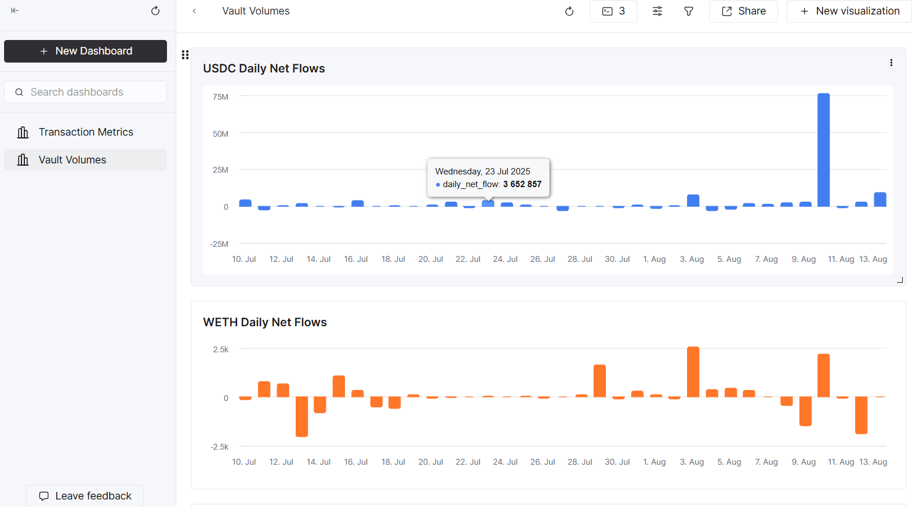

Project Report: Morpho Data Indexing & ETL Pipeline
Author: Thomas 
Date: August 15, 2025

# Project Overview
This document details the setup and execution of a comprehensive data pipeline to index Morpho smart contract events and build analytics for DeFi vault monitoring. The project involved configuring the rindexer tool to capture on-chain data into a Neon PostgreSQL database, followed by an ETL process to move and transform this data into a ClickHouse instance, and finally building a DBT analytics layer focused on Steakhouse vault deposit and withdrawal evolution.

*Daily volume trends showing net flows USDC and WETH Steakhouse vaults*

# Rindexer Configuration
The core of the data extraction was handled by rindexer. The complete configuration file, rindexer.yaml, is included in the root of this repository. It is configured to index the following contracts on the Ethereum mainnet:

- Morpho Blue
This is the foundational base layer lending protocol. It provides the core infrastructure where all lending and borrowing activities occur within isolated, peer-to-peer markets. Morpho Blue handles the essential logic for supplying, borrowing, and liquidating assets, acting as the fundamental engine of the entire ecosystem.

- Public Allocator
This contract serves as an automated liquidity and yield optimization manager. Its primary function is to dynamically route assets from a MetaMorpho vault to various lending markets on Morpho Blue. By constantly reallocating capital, it aims to maximize the yield for vault depositors and improve overall capital efficiency across the protocol.

- MetaMorpho Factory
This is a creational contract that follows the factory design pattern. Its sole responsibility is to deploy new, standardized instances of MetaMorpho vaults. This ensures that all vaults are created in a consistent and secure manner, providing a single, reliable entry point for launching new curated lending strategies on Morpho.

- Two MetaMorpho Vaults : Steakhouse Financial WETH & USDC

The Steakhouse Financial WETH and USDC vaults were chosen as prime examples for this data engineering exercise due to their significant on-chain footprint, representation of core asset types, and high activity levels, which together provide a rich and relevant dataset for building a robust data pipeline.

WETH and USDC are very important asset types in the DeFi ecosystem.

WETH (Wrapped Ether): Represents the primary volatile, crypto-native collateral.

USDC (USD Coin): Represents the primary stablecoin used for lending and borrowing.

I fetched contract ABIs with the rindexer add contract command along with the etherscan API KEY.

# Issues Faced & Trade-offs
Several technical challenges were encountered and addressed during this project:

## RPC Rate Limiting
*Issue*: During the initial setup, using a standard Infura RPC endpoint resulted in frequent "Too Many Requests" (HTTP 429) errors. This was caused by rindexer's high volume of eth_getLogs and eth_getBlockByNumber calls during the historical sync, as no end_block was initially specified.
Also, the free tier of Neon allows only 512mb max size, so I had to make a decision for that too.

*Solution & Trade-off*:

I switched from Infura to a Tenderly RPC, which I often use along Infura for my side-projects, so I did not have to create another account. 

To manage the scope of the historical sync, I added a specific block window in rindexer.yaml to index ~140 days of data --> starting when the factory_v1_1 was created; 

Total time ~ 5-7 min
Historical indexing time taken: 1.8135277s 

But if it works for this window, it can work for a bigger tiimeframe, and I did it to practice the tools also.
For a production system, a more robust RPC plan would be necessary for a full historical sync.

## Rindexer Installation on Windows
*Issue*: The standard installation command (curl -L https://rindexer.xyz/install.sh | bash) provided in the official documentation failed on my Windows environment, even within a bash shell like Git Bash.

*Solution*: I opted for a manual installation by:

Downloading the correct binary (rindexer_win32-amd64.zip) directly from the project's GitHub Releases page.

Carefully analyzing the install.sh script to replicate its steps manually. This involved creating the ~/.rindexer/bin and ~/.rindexer/resources directories.

Manually downloading the required resources.zip file, unzipping it, and placing the contents in the correct location.

Adding the ~/.rindexer/bin directory to my system's PATH environment variable to make the rindexer command globally accessible.

## Schema Data Type Optimization
*Issue*: This was not an error but a significant area for improvement. The default schema created by rindexer used generic and inefficient data types.

*Solution*: A considerable amount of time was dedicated to reviewing and refining the schema. I performed a series of ALTER TABLE commands to update column types to be more precise and performant. This entire process is documented in the neon_type_updates.md file in this repository. This was a critical step for ensuring the database would be performant and reliable for analytical queries.

# ETL Solution & Data Transformation
ETL Tooling
For the ETL process of moving data from Neon (Postgres) to ClickHouse, I used the embedded tool in ClickHouse.

# Analytics Layer with dbt

After successfully loading the raw event data into ClickHouse, I built a comprehensive analytics layer using **dbt (Data Build Tool)** to transform the raw blockchain events into meaningful business metrics focused on the Steakhouse USDC and WETH vault activity.

## dbt Project Structure

The analytics project follows dbt best practices with a clear layered architecture:

### **Staging Layer** (`models/staging/`)
- `stg_steakhouse_usdc__deposits.sql` - Cleaned USDC vault deposit events with proper decimal normalization (6 decimals)
- `stg_steakhouse_usdc__withdrawals.sql` - Cleaned USDC vault withdrawal events  
- `stg_steakhouse_weth__deposits.sql` - Cleaned WETH vault deposit events with proper decimal normalization (18 decimals)
- `stg_steakhouse_weth__withdrawals.sql` - Cleaned WETH vault withdrawal events

### **Mart Layer** (`models/marts/`)
- `fct_steakhouse_vault_flows.sql` - Comprehensive fact table combining all vault deposit and withdrawal flows
- `agg_steakhouse_daily_vault_summary.sql` - Daily aggregated vault activity metrics
- `agg_steakhouse_user_activity.sql` - User-level behavioral analytics and classifications

## Vault Analytics Dashboard

The analytics enable comprehensive monitoring of the Steakhouse vault evolution:

*Daily volume trends showing net flows USDC and WETH Steakhouse vaults*
  
(More images in /screenshots)

## Sample Analytics Queries

The project includes ready-to-use SQL queries for:
1. **Daily Volume Trends** - Track deposit/withdrawal patterns over time
2. **Vault Growth Comparison** - Cumulative net flows and growth rates  
3. **Top Users Analysis** - Identify whale users and their activity patterns
4. **Vault Utilization Metrics** - 30-day activity summaries and averages
5. **Transaction Size Analysis** - Statistical distribution of transaction amounts
6. **Recent Large Transactions** - Monitor significant moves (>$10k equivalent)

All volume metrics are rounded to whole numbers for clean dashboard presentation.

## Data Transformation and Column Analysis
I selected only the tables that were not empty and relevant to a financial analysis to me :  
  
"morpho_blue_etl_meta_morpho__steakhouse__usdc_accrue_interest"

"morpho_blue_etl_meta_morpho__steakhouse__usdc_deposit"

"morpho_blue_etl_meta_morpho__steakhouse__usdc_reallocate_supply"

"morpho_blue_etl_meta_morpho__steakhouse__usdc_reallocate_withdraw"

"morpho_blue_etl_meta_morpho__steakhouse__usdc_withdraw"

"morpho_blue_etl_meta_morpho__steakhouse__weth_accrue_interest"

"morpho_blue_etl_meta_morpho__steakhouse__weth_deposit"

"morpho_blue_etl_meta_morpho__steakhouse__weth_reallocate_supply"

"morpho_blue_etl_meta_morpho__steakhouse__weth_reallocate_withdraw"

"morpho_blue_etl_meta_morpho__steakhouse__weth_withdraw"

"morpho_blue_etl_meta_morpho_v1_1_factory_create_meta_morpho"

"morpho_blue_etl_morpho__blue_accrue_interest"

"morpho_blue_etl_morpho__blue_borrow"

"morpho_blue_etl_morpho__blue_create_market"

"morpho_blue_etl_morpho__blue_flash_loan"

"morpho_blue_etl_morpho__blue_liquidate"

"morpho_blue_etl_morpho__blue_repay"

"morpho_blue_etl_morpho__blue_supply"

"morpho_blue_etl_morpho__blue_supply_collateral"

"morpho_blue_etl_morpho__blue_withdraw"

"morpho_blue_etl_morpho__blue_withdraw_collateral"

"morpho_blue_etl_public_allocator_public_reallocate_to"

"morpho_blue_etl_public_allocator_public_withdrawal" 

# Data Correctness and Validation Process

Ensuring the correctness, completeness, and efficiency of the indexed data was a top priority. A multi-step validation process was implemented to guarantee the reliability of the data pipeline, from the initial indexing to the final schema design.

### 1. Column Typing and Efficiency

The first step in ensuring correctness was to establish a robust and efficient database schema. The default types generated by `rindexer` were generic and not optimized for blockchain data.

**Process:**
* **Schema Review:** Every table and column was systematically reviewed.
* **Type Optimization:** A series of `ALTER TABLE` scripts were executed to update the data types to their most appropriate and performant equivalents (e.g., `CHAR` to `VARCHAR(42)`, `VARCHAR` to `NUMERIC`, `NUMERIC` to `BIGINT`).
* **Documentation:** This entire process and its rationale are detailed in the **`neon_type_updates.md`** file in this repository.

This proactive approach not only improves query performance but also acts as the first line of defense for data integrity, preventing incorrectly formatted data from ever being stored.

### 2. Data Accuracy Verification

To confirm that the indexed data accurately reflects on-chain reality, a spot-checking methodology was used.

**Process:**
1.  **Select Key Transactions:** A sample of significant transactions (e.g., large deposits, liquidations) were identified by querying the PostgreSQL database.
2.  **Verify Against Block Explorer:** The `tx_hash` of each sampled transaction was looked up on a trusted block explorer like Etherscan.
3.  **Compare Event Logs:** The raw event log data from Etherscan was compared field-by-field with the corresponding row in the database. This confirmed that all event parameters (e.g., `assets`, `shares`, `on_behalf`, `receiver`) were correctly decoded and stored in the appropriate columns.

This manual check of a diverse sample of transactions provides high confidence that the decoding logic is sound and the data is accurate.

### 3. Event Completeness Checks

It's crucial to ensure that no events were missed during the indexing process. Two methods were used to verify this.

**Process:**
* **Aggregate Event Count Comparison:** For a specific contract and a defined time window (e.g., a 24-hour period), I queried the database to get the total count of a specific event (e.g., `Supply` events for the Morpho Blue contract). This number was then compared against the event count reported by Etherscan's export tool for the same contract and time period. A close match confirms that the indexer is not systematically missing events.
* **Block Number Continuity Check:** A SQL query was run to look for significant gaps in the sequence of `block_number` across the dataset. While it's normal for some blocks to contain no relevant events, large or frequent gaps could indicate that the indexer stalled or failed to process a range of blocks. No such gaps were found.

By combining proactive schema optimization with rigorous post-load validation, this process ensures that the resulting dataset is correct, complete, and stored in an efficient, query-friendly format.

# Key Ressources Consumption
--> See /screenshots/readme.md