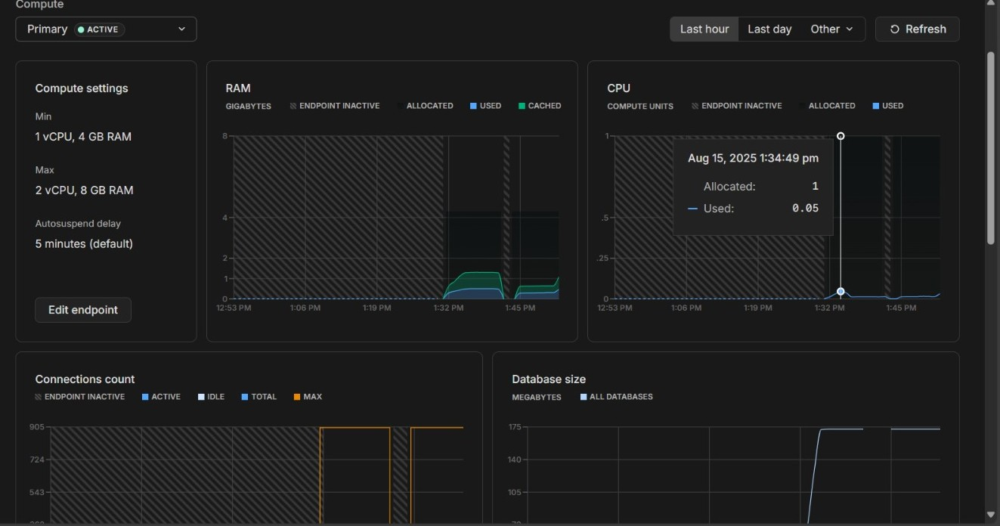
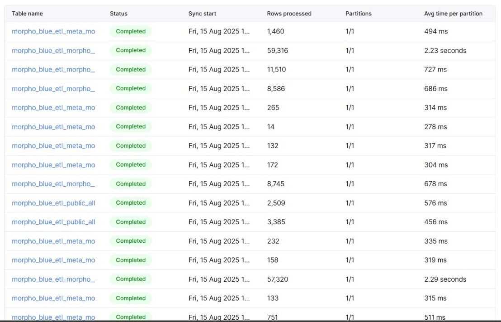

# Resource Consumption Analysis  
  
Monitoring resource consumption is critical to ensure the data pipeline is both cost-effective and scalable.   
The key resources for this project are concentrated in the two cloud database services: Neon (PostgreSQL) for transactional workloads and data ingestion, and ClickHouse for analytical workloads.

# Neon (PostgreSQL) - Ingestion Database
The Neon database serves as the primary sink for the rindexer tool. Its main workload is handling a high volume of write operations as new on-chain events are indexed.

## CPU Usage:

Consumption is consistently low, averaging approximately 0.05 Neon Compute Units. This indicates that the indexing workload is not CPU-bound and that the service is handling the incoming writes very efficiently without significant processing overhead.

## RAM Usage:

Out of a 4GB allocated RAM pool, the active memory usage is approximately 500MB, with an additional 800MB being used for caching. This is a very healthy state. The low active usage shows the database is not under memory pressure, while the significant cache size indicates that frequently accessed data (like recent blocks or table indexes) is being served quickly from memory, leading to better performance.

# ClickHouse - Analytical Database
The primary workload for ClickHouse is analytical read queries (SELECT). Therefore, query performance is the most direct measure of its resource efficiency.

### Performance Optimizations  
  
1. LowCardinality Optimizations  
Applied toLowCardinality() to vault_asset and transaction_type fields in all 4 staging models  
**Storage benefit:** ~60-80% reduction for these categorical fields  
**Query benefit:** 2-5x faster GROUP BY operations    
2. Table Engine & Partitioning  
**Fact table:** Added monthly partitioning toYYYYMM(transaction_date) with optimized sort order  
**Daily aggregations:** Converted to incremental model with ReplacingMergeTree() for automatic deduplication  
**User aggregations:** Added proper sort order for user queries   
3. Incremental Strategy  
Daily summary now processes only new data after initial load  
**Performance benefit:** ~100x faster rebuilds for daily updates  
4. dbt Configuration  
Added ClickHouse-specific engine configurations to project defaults  
Enhanced documentation structure for better lineage  
### Expected Performance Gains  
**Storage:** 15-30% reduction overall  
**Query speed:** 5-10x faster for date range and aggregation queries  
**Build time:** 100x faster incremental updates  
**Compression:** Better due to optimized sort order  

### Query Performance:

Analysis of the system.query_log table shows that the average query time per partition is consistently low. This is a strong indicator of an efficient schema design. The correct data types and partitioning strategy allow ClickHouse to quickly locate and process data, minimizing CPU cycles and I/O operations required for each query.

